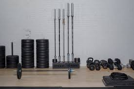

# WodClick Game
Let's the user have some fun and click some Well known work out from Cross fit.

Don't click on the same work out more than once, after the images schuffle, can your remember the all the WODS you have clicked on?.

Try to beat your top score

### [Wod Click Game]( https://reasonwithme.herokuapp.com/)



## Getting Started

These instructions will get you a copy of the project [WodClickGame](https://github.com/Mlusso06/Random_Click_Game) up and running on your local machine for development and testing purposes. See deployment for notes on how to deploy the project on a live system.

### Prerequisites

What things you need: 
* code editing [Visual Studio](https://visualstudio.microsoft.com/)

```
Open your Code editing software (example Visual Studio)

Open the "Terminal" in studio
perform a git clone https://github.com/Mlusso06/Random_Click_Game.git
```

### Installing

After having the files cloned into your Studio, I would perform a 
* "Save Workspace AS" to have a workspace to come back to.
* Next you will need to install your code's Dependencies
    * This will capture all the items in your package.json file

See below on how to perfom the install.

```
npm i
```
You will be installing the following npm packagages:
* react
* react-dom
* react-scripts

## Available Scripts

In the project directory, you can run:

### `yarn start`

Runs the app in the development mode.<br />
Open [http://localhost:3000](http://localhost:3000) to view it in the browser.

The page will reload if you make edits.<br />
You will also see any lint errors in the console.

you should see the below when it starts
```
Compiled successfully!

You can now view clickgame in the browser.

  Local:            http://localhost:3000
  On Your Network:  http://192.168.1.111:3000

Note that the development build is not optimized.
To create a production build, use yarn build.
```


# Project work

## Deployment

We deployed with [Heroku](https://dashboard.heroku.com/apps)


#### read individual instructions for more detal

## The Web site was Built With

## Learn More

You can learn more in the [Create React App documentation](https://facebook.github.io/create-react-app/docs/getting-started).

To learn React, check out the [React documentation](https://reactjs.org/).


## Project Team:

* **Mike Lusso** - *Team Lead* - [Mlusso06](https://github.com/Mlusso06)

## BootCamp Acknolegments 

This project was part of the Vanderbilt coding Bootcamp - click [Vanderbilt](https://bootcamps.vanderbilt.edu/)  for details and how you can enroll.

## Acknowledgments

* Thanks to our Class instructor, and the TAs that have helped define and layout the expectations for the assignment. 